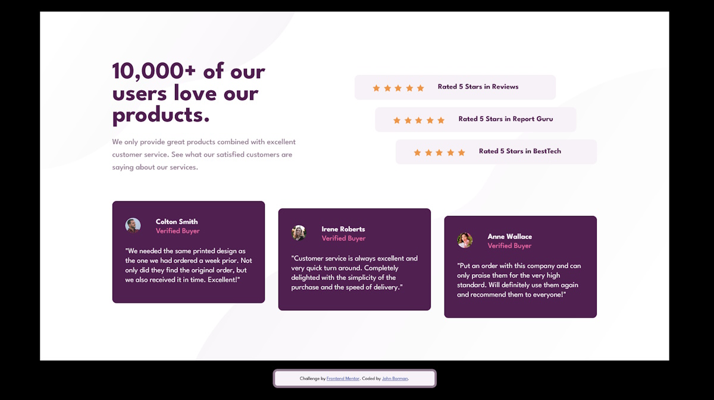

# Frontend Mentor - Social proof section solution

This is a solution to the [Social proof section challenge on Frontend Mentor](https://www.frontendmentor.io/challenges/social-proof-section-6e0qTv_bA). Frontend Mentor challenges help you improve your coding skills by building realistic projects. 

## Table of contents

- [Overview](#overview)
  - [Screenshot](#screenshot)
  - [Link](#link)
- [My process](#my-process)
  - [Built with](#built-with)
  - [I am learning](#i-am-learning)
  - [Continued development](#continued-development)
  - [Useful resources](#useful-resources)
- [Author](#author)
- [Acknowledgments](#acknowledgments)

## Overview

### Screenshot

### Link

- Solution URL: [ Social Proof Section Master](https://madartistphoto.github.io/social-proof-section-master/)

## My process

### Built with

- Visual Studio Code (my code editor of choice most of the time)
- Zoner Photo Studio X (for viewing the Design Files)
- PicPick (especially the RULER for measuring various things in the Design Files)
- Paint.net (for various image related work)
- GitHub (for storing the code online)

### I am learning

- More of the capabilities that Visual Studio Code has.

- Using GitHub (particularily Commiting and Publishing from VSC). This is challenging as GitHub is very powerful and complex. If I don't use it on a regular basis I forget how to do the things I did last time I used it. And GitHub is still one of the most un-intuative things I have ever seen.

- Using .gitignore (and how to exclude the files I don't need to publish to GitHub)

- Creating an effective and informative README file.

### Continued development

- This is the first time I delved deeper into FLEX using flex-start and flex-end. It was a bit of trial and error at first, but it all came together. I will be working to learn more and more about FLEX.

- I NEED to do more pre-coding layout work. By that I mean I need to actually draw out the layout design on a piece of paper. Then I can actually visualize each component and the best use for margins and padding for those components.

- I need to get back to coding on a daily basis. After all, practice makes perfect. Well, in my case, practice makes me a little better than yesterday.

### Useful resources

- [PicPick](https://picpick.app/en/) - I'm cheap so I don't get the Figma files. That means the only design reference I have is the Design Preview Images. Using the Pixel Ruler in PicPick gives me the ability to measure various things in the design images.

- Any good Image Viewing Program - I use Zoner Photo Studio X.

## Author

- Website - [John Borman](https://madartistphoto.github.io/FM-Landing-Page/)
- Frontend Mentor - [John](https://www.frontendmentor.io/profile/MadArtistPhoto)

## Acknowledgments

Just a shout out to all other creators on Frontend Mentor. It is wonderful learning experience to view other solutions and see how other Coders create the same thing.
